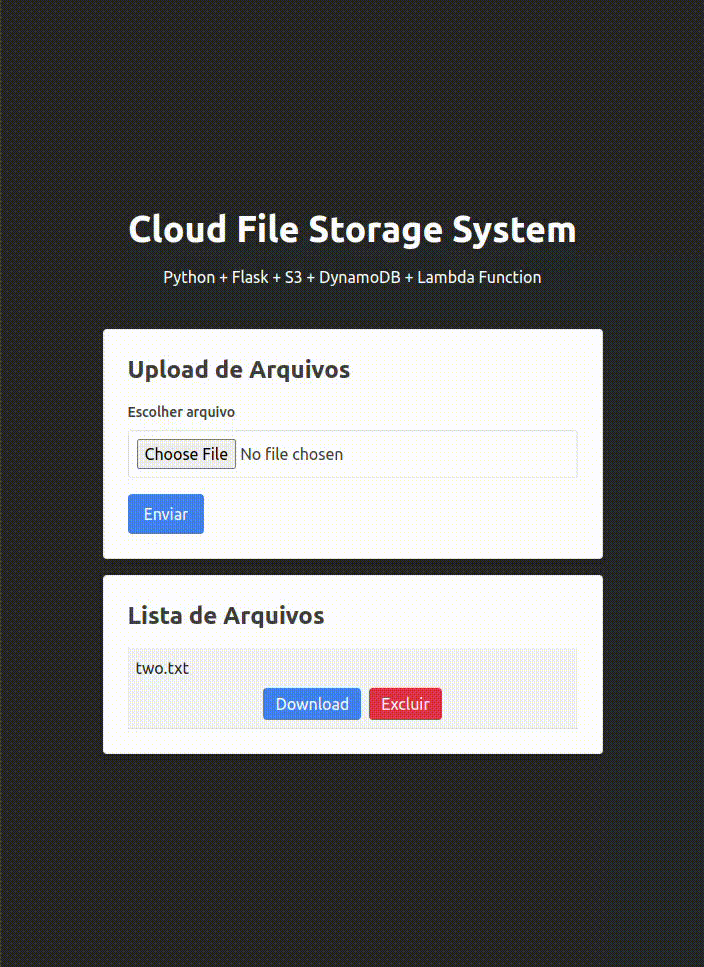

# Cloud Storage System
Este projeto é um sistema simples de armazenamento de arquivos na nuvem, desenvolvido utilizando Python no back-end com o framework Flask, React.js no front-end, e serviços da AWS (simulados localmente com o LocalStack) para armazenamento de arquivos (Amazon S3), armazenamento de metadados (Amazon DynamoDB), e processamento assíncrono (Amazon Lambda, opcional).

# Tecnologias Utilizadas
## Back-end:
- Linguagem: Python
- Framework: Flask
- AWS Services (LocalStack):
- Amazon S3 (para armazenamento de arquivos)
- Amazon DynamoDB (para armazenar metadados dos arquivos)
- Amazon Lambda (para processamento assíncrono)
## Front-end:
- React.js
- Vite
## Funcionalidades do Sistema
- Upload de Arquivos: Permitir que os usuários realizem o upload de arquivos para a plataforma.
- Listagem de Arquivos:
Exibir a lista de arquivos armazenados na nuvem.
- Download de Arquivos:
Possibilitar o download de arquivos armazenados.
- Exclusão de Arquivos:
Permitir que os usuários excluam arquivos.

## Função dos Serviços AWS:

### Amazon S3 (Simple Storage Service):

Serviço de armazenamento de objetos na nuvem.
Usado para armazenar os arquivos enviados pelos usuários.
No código, é simulado localmente usando o LocalStack.
### Amazon DynamoDB:

Serviço de banco de dados NoSQL totalmente gerenciado.
Usado para armazenar metadados dos arquivos (como nomes de arquivos) associados aos objetos no S3.
No código, é simulado localmente usando o LocalStack.
### Amazon Lambda:

Serviço de computação serverless que permite a execução de código em resposta a eventos.
No código, é invocado para realizar uma ação (a função 'print-lambda') após o upload de um arquivo.
Pode ser usado para processamento assíncrono ou outras ações desacopladas do fluxo principal da aplicação.

